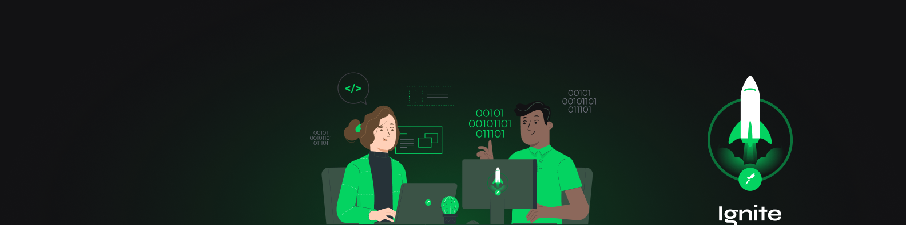

<div align="center" id="top"> 
  

&#xa0;

  <!-- <a href="https://finapi.netlify.com">Demo</a> -->
</div>

<h1 align="center">Ignite | Trilha NodeJS: Projeto FinAPI</h1>

<p align="center">
  

 

  <!--  -->

  <!--  -->

  <!--  -->

<!-- <h4 align="center">
	🚧 <strong> Em construção... </strong> 🚧 -->
</h4>
</p>

<hr>

<p align="center">
  <a href="#dart-sobre">Sobre</a> &#xa0; | &#xa0; 
  <a href="#clipboard-requisitos">Requisitos</a> &#xa0; | &#xa0;  
  <a href="#heavy_check_mark-regras-de-negócio">Regras de Negócio</a> &#xa0; | &#xa0;
  <a href="#rocket-tecnologias">Tecnologias</a> &#xa0; | &#xa0;
  <a href="#warning-pré-requisitos"> Pré requisitos</a> &#xa0; | &#xa0;
  <a href="#checkered_flag-começando">Começando</a> &#xa0; | &#xa0;
  <a href="#memo-licença">Licença</a> &#xa0; | &#xa0;
  <a href="https://github.com/thiilins" target="_blank">Autor</a>
</p>

<br>

## :dart: Sobre

Criando uma aplicação - API de finanças, projeto do curso Ignite trilha Nodejs da Rocketseat :rocket:

<p align="right">(<a href="#top">Voltar para o topo</a>)</p>

## :clipboard: Requisitos

- [x] Deve ser possivel Criar uma conta.
- [x] Deve ser possivel buscar o extrato bancário do Cliente.
- [x] Deve ser possivel Realizar um depósito.
- [x] Deve ser possivel realizar um saque.
- [x] Deve ser possivel buscar o extrato bancário do cliente por data.
- [x] Deve ser possivel atualizar dados da conta do cliente .
- [x] Deve ser possivel obter dados da conta do cliente.
- [x] Deve ser possivel deletar uma conta.
- [x] Deve ser possivel obter o saldo da conta.

<p align="right">(<a href="#top">Voltar para o topo</a>)</p>

## :heavy_check_mark: Regras de negócio

- [x] Não deve ser possivel cadastrar uma conta com cpf já existente.
- [x] Não deve ser possivel fazer depósito em uma conta não existente.
- [x] Não deve ser possivel buscar extrato em uma conta não existente .
- [x] Não deve ser possivel fazer um saque em uma conta não existente .
- [x] Não deve ser possivel fazer saque quando o saldo for insuficiente .
- [x] Não deve ser possivel excluir uma conta não existente .

<p align="right">(<a href="#top">Voltar para o topo</a>)</p>

## :rocket: Tecnologias

As seguintes ferramentas foram usadas na construção do projeto:

- [Node.js](https://nodejs.org/en/)
- [ExpressJS](https://expressjs.com/pt-br/)

<p align="right">(<a href="#top">Voltar para o topo</a>)</p>

## :warning: Pré requisitos

Antes de começar :checkered_flag:, você precisa ter o [Git](https://git-scm.com) e o [Node](https://nodejs.org/en/) instalados em sua maquina.

<p align="right">(<a href="#top">Voltar para o topo</a>)</p>

## :checkered_flag: Começando

```bash
# Clone este repositório
$ git clone https://github.com/thiilins/finapi

# Entre na pasta
$ cd finapi

# Instale as dependências
$ yarn

# Para iniciar o projeto
$ yarn start

# Para iniciar como desenvolvedor

$ yarn dev
# O app vai inicializar em <http://localhost:3000>
```

<p align="right">(<a href="#top">Voltar para o topo</a>)</p>

## :memo: Licença

Este projeto está sob licença MIT. Veja o arquivo [LICENSE](LICENSE.md) para mais detalhes.

Feito com :heart: por <a href="https://github.com/thiilins" target="_blank">Thiago Lins</a>

&#xa0;

<p align="right">(<a href="#top">Voltar para o topo</a>)</p>
